# Bicopter
Website and arduino code I wrote for a radio controlled bicopter drone that I made in Summer 2019.

[Video](https://youtu.be/fx83XLyZHBg) / [CAD](https://cad.onshape.com/documents/2522e998c9fab8f022bfa03c/w/0178b92114d21ebaa118384f/e/408eafad1609fd8326af6cff?renderMode=0&uiState=6345f4065453a95c15e37593)

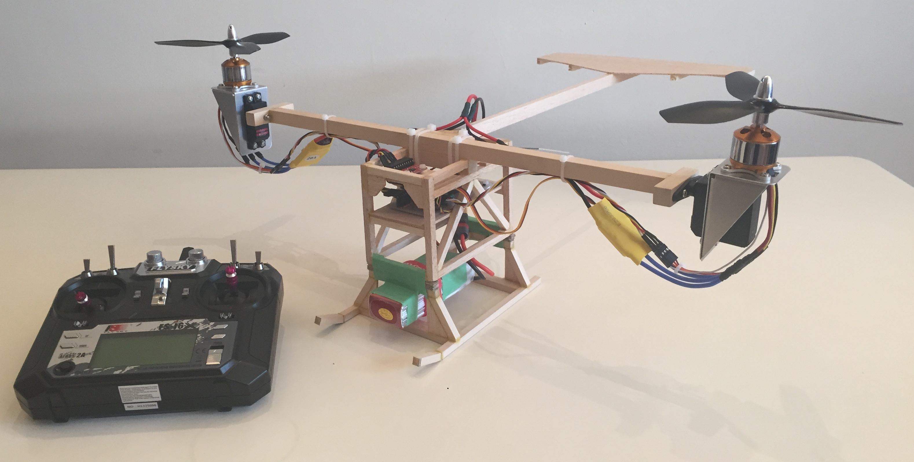

## Project Overview
- I designed and built this bicopter drone as a hobby project, using limited financial and fabrication resources that I had available.
- I was given access to my university's waterjet cutter out of generosity for two sheet aluminum motor mounts. All other structural components are basswood or balsa wood, cut using a handsaw or knife and bonded with wood glue.
- The electronics consist of an Arduino Micro, IMU, RC receiver, two Electronic Speed Controllers (ESCs), two brushless DC (BLDC) motors, two servo motors, and a lithium ion battery.

## Stability Control
- Since the main objective of the project was to understand control design, I implemented the stability controller by programming an Arduino, rather than buying an off-the-shelf flight controller as is typically done with hobby drones.
- Loosely inspired by the Bell Boeing V-22 Osprey, the drone stabilizes itself by tilting the propellers--synchronously for pitch, and in opposite directions for yaw.
- Only after designing and building all of the hardware, I noticed a critical design flaw—the heavy BLDC motors are too far from the propeller tilt axis, causing the large inertia to tilt the entire body of the drone for pitch control, where ideally the body remains upright and the tilt of the drone body happens through propeller thrust. This issue was made worse with the slow response time of the servo motors used for tilt control.
- This meant that the initial prototype was incredibly unstable in pitch. This led to many crashes and broken parts during testing and development (I would not recommend building drones out of balsa wood...).
- When I realized that software/control design alone could not stabilize the drone, I added a rear wing to act as an aerodynamic damper for pitch-axis rotation. This enabled the drone to fly stably, although requiring decent piloting skills.
- Through this project, I learned an important lesson that both mechanical and software design must be done carefully for stable robot control, and understanding the underlying physics is critical for the effective design of dynamic robots.

## Picture Gallery

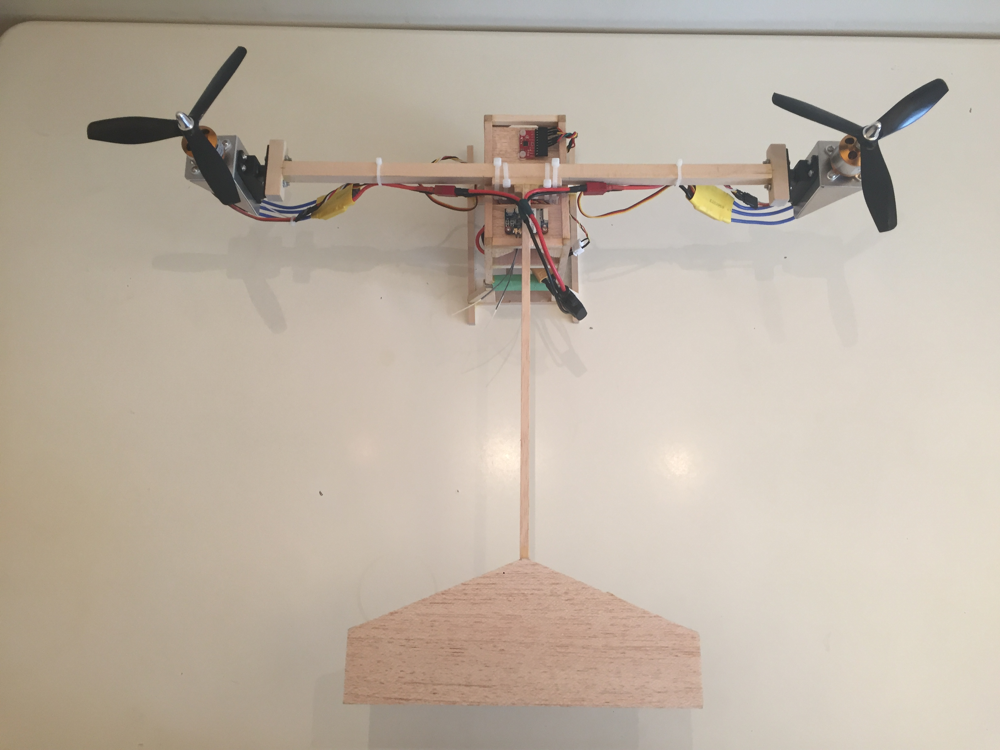
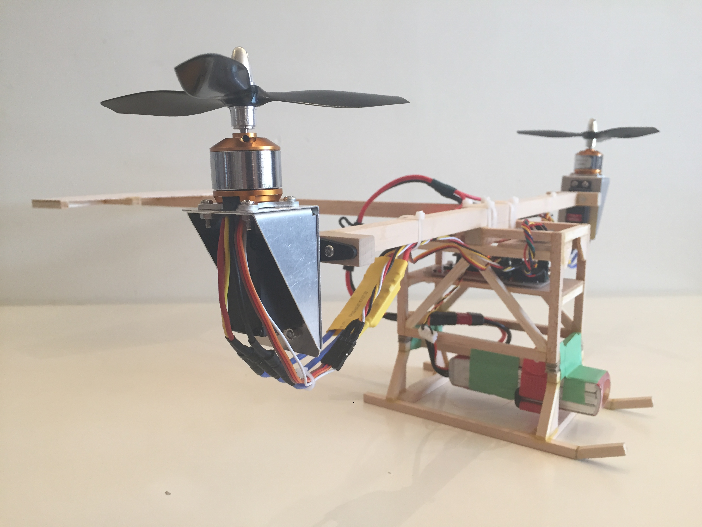
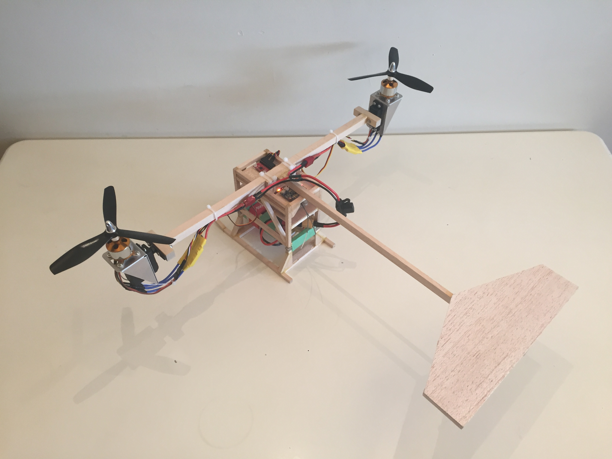
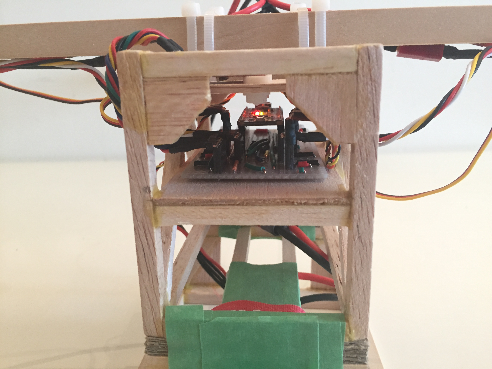
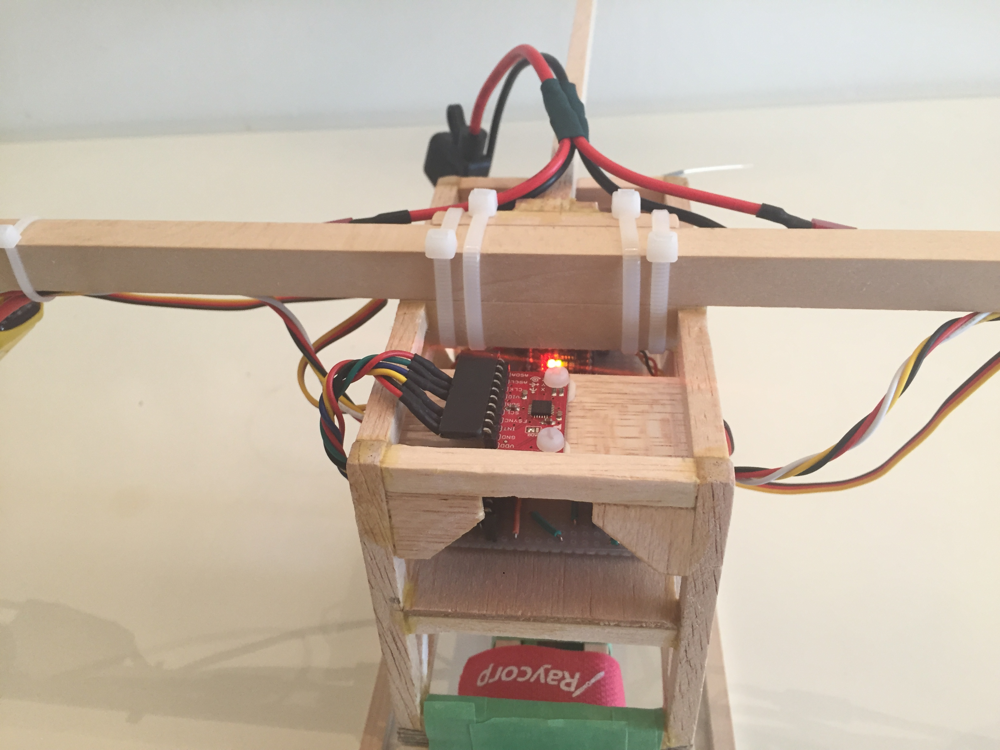
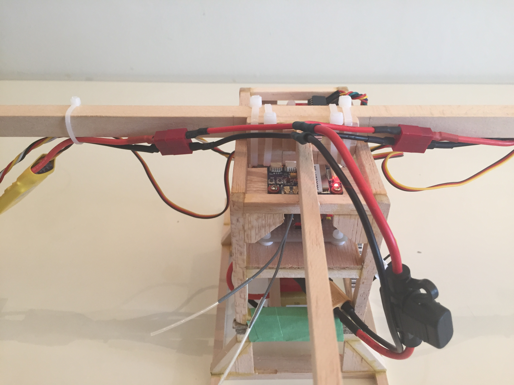

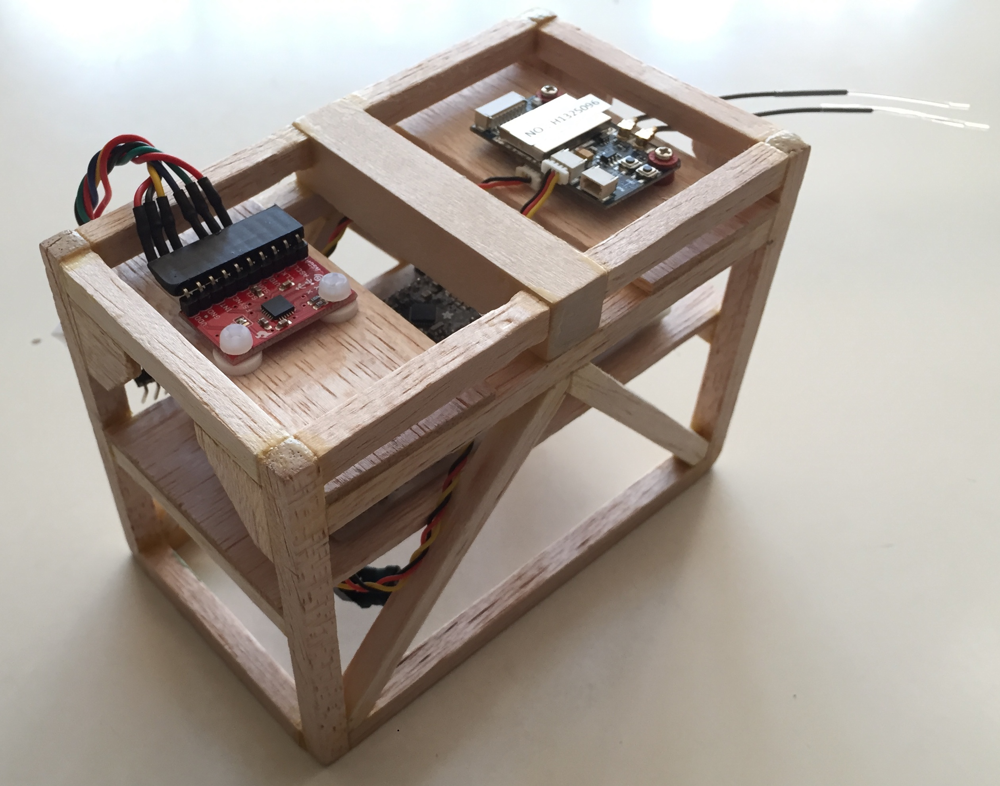
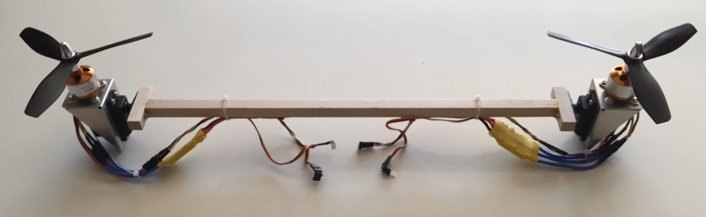
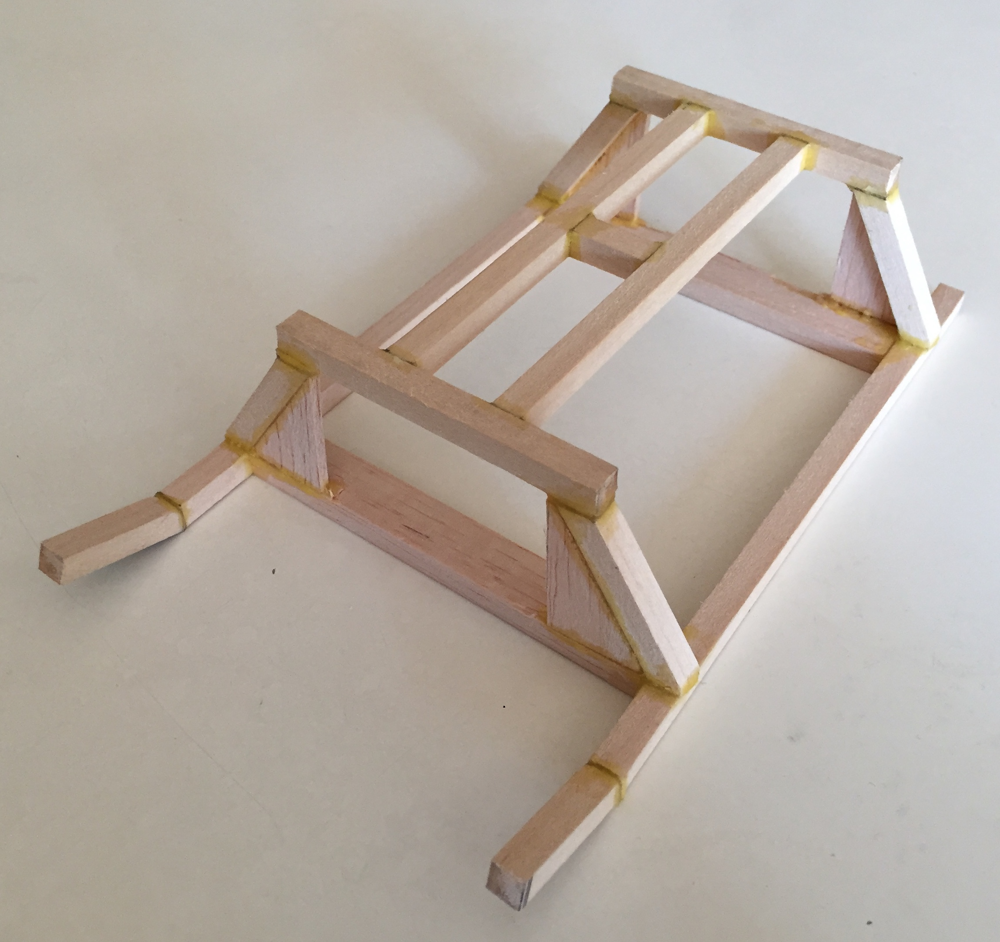
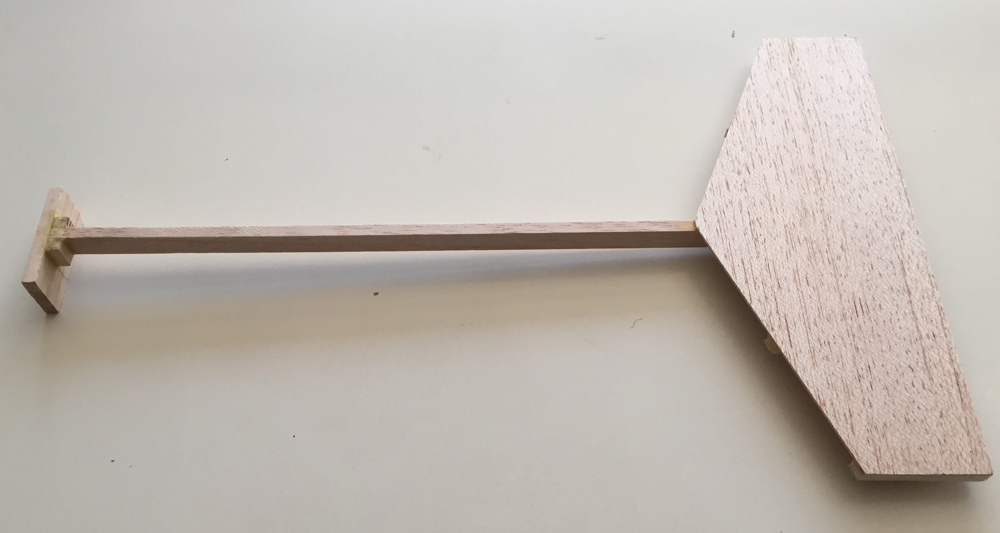
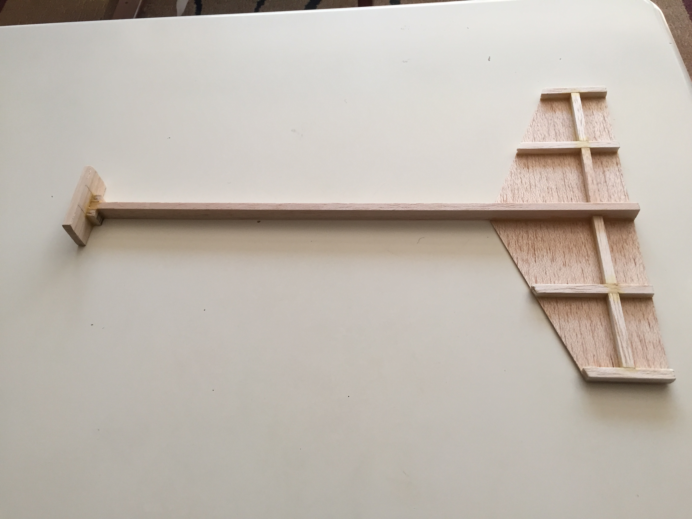